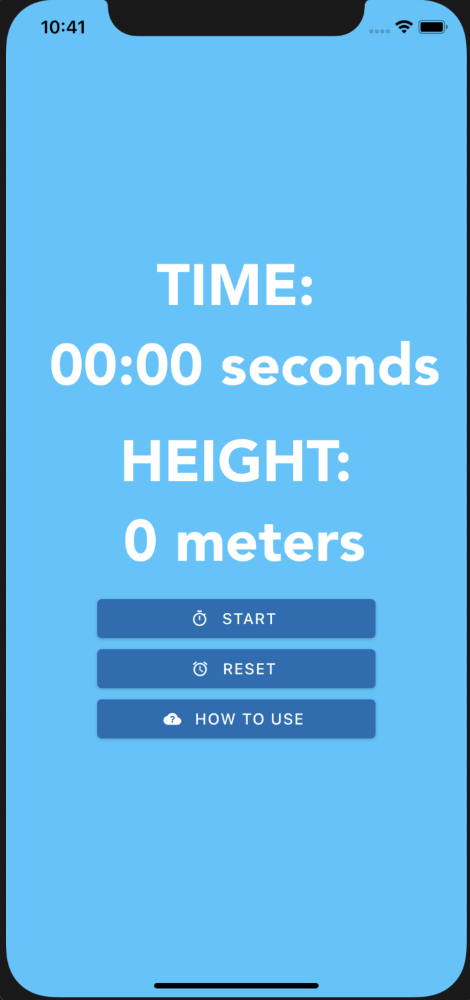
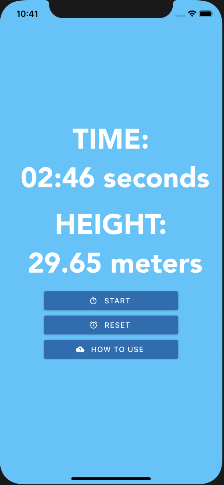

# Physics Height Calculator

## Distance Equation

Vertical Distance = (1/2) * Acceleration * Time^2

Where acceleration is gravity, 9.8 m/s and time is the time it takes to hit the bottom from a certain height. (Vertical Distance Only)

Created using React Native.

## Launch Screen

## Timer Screen

## Calculation

## How To Use

